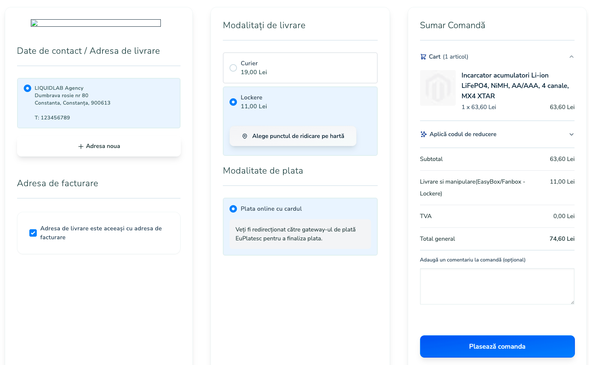
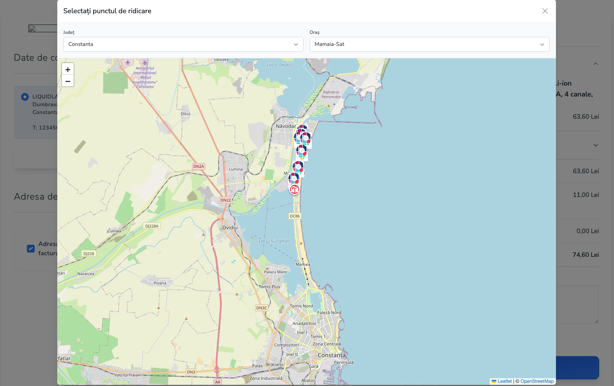
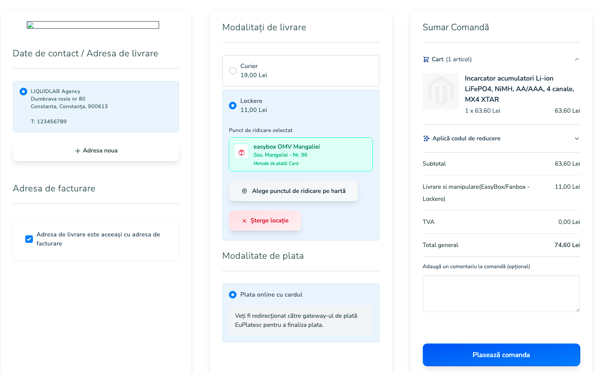
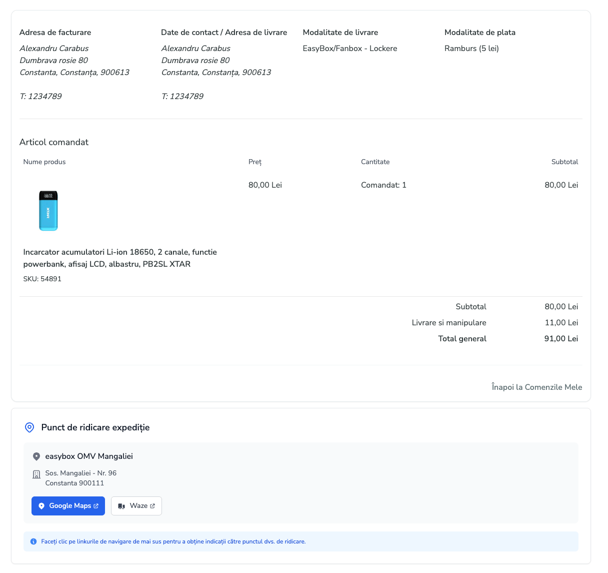

# Liquidlab_InnoShipHyva

Hyvä Checkout compatibility layer for the **InnoShip_InnoShip** shipping module.

Developed by **[Liquidlab Agency](https://liquidlab.ro/)** — **Romania’s first full-service Hyvä agency** and the first Hyvä partner in Romania.  

---

The upstream `InnoShip_InnoShip` module ships a working Luma checkout integration: a PUDO (pickup-drop-off) point picker built on Knockout/jQuery components and `window.checkoutConfig`. None of that runs inside Hyvä Checkout, which uses Magewire + Alpine.js and does not expose `checkoutConfig` to the frontend.

This module bridges that gap. It replaces InnoShip's checkout-side UI with a **Hyvä-native equivalent** while continuing to use InnoShip's database, shipping carrier, AWB generation, and order-management code unchanged.

This module is an independent, community-developed integration. It is not affiliated with, endorsed by, or developed in partnership with Innoship.

---

## Screenshots

<table>
  <tr>
    <td align="center" width="33%">
      <a href="media/checkout_first_step.png" target="_blank"></a><br/>
      <sub>Checkout — locker method (no point selected)</sub>
    </td>
    <td align="center" width="33%">
      <a href="media/checkout_second_step.png" target="_blank"></a><br/>
      <sub>Interactive Leaflet map picker</sub>
    </td>
    <td align="center" width="33%">
      <a href="media/checkout_third_step.png" target="_blank"></a><br/>
      <sub>Selected pickup point with “Clear” button</sub>
    </td>
  </tr>
  <tr>
    <td align="center" colspan="3">
      <a href="media/customer_account.png" target="_blank"></a><br/>
      <sub>Customer order view — pickup point summary</sub>
    </td>
  </tr>
</table>

---

## What it does

### 1. PUDO point picker in Hyvä Checkout

When the customer chooses an InnoShip shipping method (e.g. `innoshipcargusgo_*`), Hyvä Checkout renders a **"Choose Pickup Point on Map"** button under the shipping method.


- Clicking it opens a modal with an interactive Leaflet map of available pickup points.
- The customer can narrow results by **county and city** (county/city lists come from the `innoship_pudo` table).
- If no county is selected but the customer's shipping address has a Romanian region, the map auto-centers on that region and shows points within ~50 km, sorted by distance.
- Marker icons reflect the courier (Cargus, DPD, FAN, eMag, Posta Romana, etc.).
- Each marker's popup shows the address, phone number, opening hours, accepted payment methods, and a **"Select This Point"** button.


The picker is implemented as two Magewire components, `Magewire\PudoPicker` (modal + filters + map data) and `Magewire\PudoPoint` (selected-point summary), wired together via `emit()` / `$listeners`. The map UI itself is an Alpine.js component (`view/frontend/web/js/pudo-picker.js`).

### 2. Persisted PUDO selection

The PUDO selection is **saved to the checkout session** as soon as the customer picks a point — it is not transient UI state. This gives the picker real saving functionality:

- The selection survives Magewire roundtrips during checkout (filter changes, address edits, payment-method switches).
- It survives full page reloads. If the customer refreshes mid-checkout or returns to checkout in the same session, the picker remounts with the previously chosen point already selected and displayed — no need to re-pick.
- The selection is also written to the quote shipping address (`innoship_pudo_id`, `innoship_courier_id`, plus extension attributes) and the address fields are rewritten to the pickup point's address. This is required because InnoShip's AWB-generation code reads the destination from the shipping address.
- On `PudoPicker` mount, the component reconciles the quote shipping address against the session: if the session holds a selected PUDO whose ID is missing from the current quote address, it re-applies the selection so order submission carries the PUDO ID. The check is idempotent (early-returns when the IDs already match) so it does not trigger redundant quote saves.

The session storage key is `innoship_selected_pudo_point` (defined as `INNOSHIP_PUDO_SESSION_KEY` in `Magewire\PudoPicker` and `Magewire\PudoPoint`). The customer can clear the selection at any time using the **"Clear PUDO"** button shown next to the chosen point.


### 3. Pre-submit observer

`Observer\CheckoutSubmitBefore` listens on `checkout_submit_before` (which fires earlier than the InnoShip module's own `sales_model_service_quote_submit_before` observer). It re-stamps the PUDO data onto the shipping address from the most authoritative available source (quote custom data → session → existing address fields) and saves the quote.

This is defensive: Hyvä's checkout flow has multiple steps that may reload or restore the shipping address, and InnoShip's downstream code expects the PUDO fields to be present *before* its own observer runs. Without this, late address restorations can blank out `innoship_pudo_id` and the AWB generation fails.

### 4. Disabled upstream controllers

Several `InnoShip_InnoShip` frontend controllers exist only to serve the Luma checkout JS (`view/frontend/web/js/checkout.js`) and have no purpose in a Hyvä-only storefront. Rather than fork or patch `InnoShip_InnoShip`, this module declares DI preferences in `etc/frontend/di.xml` that swap each unused controller class for a shared no-op stub (`Controller/Disabled/NotFound`) which throws `NotFoundException` — every dead URL returns a clean 404.

Disabled endpoints:

- `/innoshipf/pudo/getpudo`
- `/innoshipf/pudo/getmap`
- `/innoshipf/pudo/setpudo`
- `/innoshipf/pudo/getpudofromlocation`
- `/innoshipf/courier/listcouriers`
- `/innoshipf/courier/setcourierid`

The stub implements both `HttpGet`/`HttpPostActionInterface` and `CsrfAwareActionInterface` so POSTs reach the 404 instead of being rejected at 405 / CSRF. Admin AWB controllers (`Adminhtml/Awb/*`) are untouched — the preferences are scoped to `etc/frontend/di.xml`.

### 5. Validation gate

`Magewire\PudoPoint` implements Hyvä's `EvaluationInterface`. If the selected shipping method is an InnoShip method, the customer cannot proceed past the shipping step until a pickup point is chosen — Hyvä displays an inline error and emits `shipping:method:error`.

### 6. Order-view PUDO summary

On the customer's order view page (My Account → Orders), the module overrides InnoShip's `order_info_innoship_front` block with a Hyvä-friendly template (`templates/order/order_shipping_pudo.phtml`). It shows the chosen pickup point's name, address, and "Open in Google Maps" / "Open in Waze" deep links. PUDO lookups go through `ViewModel\PudoInfo`, which reads from the `innoship_pudo` table via this module's repository.


## How it integrates with InnoShip_InnoShip

| Concern | Owned by |
|---|---|
| `innoship_pudo` table + cron sync of pickup points | `InnoShip_InnoShip` (this module reads only) |
| Shipping carriers (`innoshipcargusgo`, etc.) and AWB generation | `InnoShip_InnoShip` |
| `quote_address` / `sales_order_address` columns (`innoship_pudo_id`, `innoship_courier_id`, `innoship_shipping_price`) | `InnoShip_InnoShip` schema |
| Marker images and bundled Leaflet 1.9.4 assets | `InnoShip_InnoShip::images/...`, `InnoShip_InnoShip::js/leaflet.js` |
| Hyvä-compatible PUDO picker UI + modal | This module |
| Magewire components + Alpine map controller | This module |
| Pre-submit safety observer | This module |
| Disabling unused `InnoShip_InnoShip` frontend controllers via DI preferences | This module |
| Hyvä order-view template override | This module |

The module is also registered with Hyvä's `CompatModuleRegistry` (in `etc/frontend/di.xml`) so Hyvä knows that `Liquidlab_InnoShipHyva` is the compatibility layer for `InnoShip_InnoShip` and will skip InnoShip's Luma-specific frontend assets.

## Requirements

- Magento 2.4+
- PHP 8.1+
- `InnoShip_InnoShip` (provides the schema, Leaflet assets, and shipping carriers)
- `Hyva_Checkout`
- `magewirephp/magewire`

## Installation
```bash
composer require liquidlab-agency/magento2-innoship-hyva-checkout
```

---

## About Liquidlab

**[Liquidlab Agency](https://liquidlab.ro/)** is Romania’s first full-service Hyvä agency and the first Hyvä partner in the country.

We specialize in **Magento 2 development** and **performance optimization**, transforming slow stores into blazing-fast, high-converting Hyvä platforms.

Our three pillars — **Security • Stability • Performance** — guide every project we deliver.

Whether it’s custom Hyvä implementations, store migrations, rescue projects for troubled Magento stores, or AI-accelerated development, we deliver scalable, secure, and lightning-fast e-commerce solutions.

- **Website**: [liquidlab.ro](https://liquidlab.ro/)
- **Services**: Magento 2 • Hyvä Theme • Performance • Migrations • Rescue Projects

---

## License

**Proprietary** — © Liquidlab Agency. All rights reserved.

---

*Built with ❤️ in Romania for merchants who demand the best checkout experience.*
